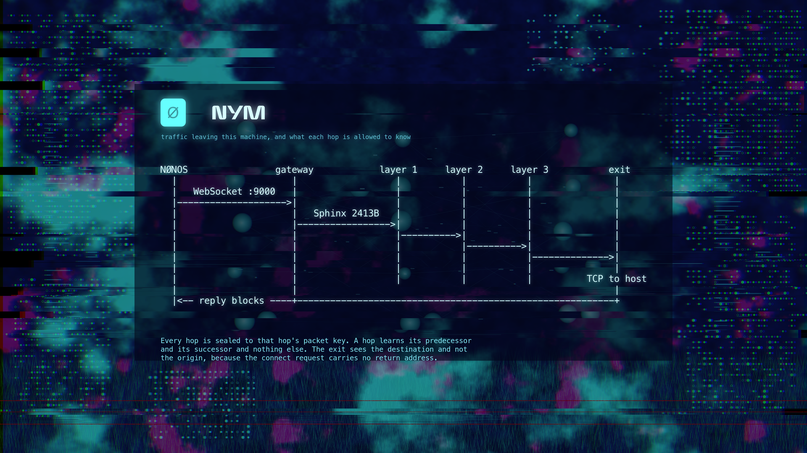

# capsule_net_nym

The Nym mixnet client. It registers with a gateway, seals application data
into Sphinx packets addressed through three mix layers, and hands them to
`net.tcp` over a WebSocket. Sphinx is reimplemented here in `no_std` against
the published format, because the reference stack cannot be linked into a
kernel userland.

This capsule is the network path, not an option on it. `capsule_socks5` sits
in front of it and resolves `net.nym` deliberately rather than `net.tcp`
(`../capsule_socks5/src/setup.rs:30`), so nothing above it has a direct route
to fall back to.

## Service

| | |
|---|---|
| handle | `net.nym` |
| endpoint | `service:4470:net.nym` |
| capabilities | `0x0013d` (CoreExec, Network, IPC, Memory, Crypto, Debug) |
| transport | `net.tcp`, registered by `net.core` |

Operations are listed in `src/protocol/ops.rs:17`. The ones a caller normally
needs are open session, set destination, send, receive and close; the rest
configure topology, timing, credentials and the trust anchor.

## Packet format

Sphinx, matching Nym's wire format so a live gateway reads our traffic.

| | bytes |
|---|---|
| header | 348 |
| payload | 2065 |
| total | 2413 |

The header is `32` ephemeral key, `16` integrity MAC and `300` encrypted
routing info, asserted at compile time in `src/sphinx/constants/sizes.rs`.
Routing information is layered so each hop strips one block and learns only
its predecessor and successor. Payloads use LIONESS wide block encryption,
ChaCha20 for the stream halves and Blake2b for the hash halves, matching
`NymLionessDigest`.

## Reaching a gateway

The client walks a bootstrap list one candidate at a time from inside the
serve loop (`src/server/connect_tick.rs:42`), not all of them at startup.
Everything downstream waits on this capsule, so a blocking connect stalls the
desktop on a handshake nobody asked for. Failed attempts back off, since
retrying at tick rate leans on gateways other people run.

Every stage waits on elapsed time rather than a count of attempts. `net.tcp`
answers "nothing has arrived yet" with an empty read costing microseconds,
while a real round trip is tens of milliseconds, so counting a handful of
those and calling the peer finished gives up three orders of magnitude early.

Stages: TCP connect and wait for ESTABLISHED, WebSocket upgrade, registration
handshake, session. The serial log names whichever fails.

    [NET-NYM] gateway bound <ip>        session established
    [NET-NYM] gateway <stage> <code>    stage failed, with the reason

## Trust

A session is refused over a topology that has not been verified
(`src/state/table/topology_gate.rs:20`). A directory records where it came
from (`src/topology/directory.rs:25`):

| Provenance | How it earns trust |
|---|---|
| `Signed` | fetched over the network, checked against an authority the operator installed |
| `Image` | compiled into the kernel, already measured, dual signed with Ed25519 and ML-DSA-65, and matched to its STARK enrollment before the jump |

There is no route-signing key. Minting one would create a single seed whose
theft redirects every route the system takes, and the image already carries a
stronger guarantee than that key could add. Each mix hop is authenticated
again by its packet key when a header is sealed for it, so a stale entry
costs a dropped packet rather than a redirected one.

## Tests

Crypto is pinned by known answer tests that run against this capsule's own
modules, pulled in by `#[path]` so they cannot drift from the shipping code.

    cd tests/live_gateway && cargo test

POLYVAL carries RFC 8452 vectors specifically because a wrong implementation
is not visibly wrong: it produces a stable, self consistent tag that verifies
against itself and against nothing else.

`tests/live_gateway` also holds an interop runner that speaks to a real
gateway. It is not part of the unit run, since it needs the network.

## Further reading

The mixnet path across capsules, including what the browser and terminal do,
is documented in the docs submodule:

- [`docs/userland/mixnet.md`](../../docs/userland/mixnet.md), the path end to
  end and what each hop is allowed to know
- [`docs/userland/network-capsules.md`](../../docs/userland/network-capsules.md),
  the service contracts for every network capsule

Both live in [NON-OS/nonos-docs](https://github.com/NON-OS/nonos-docs).
